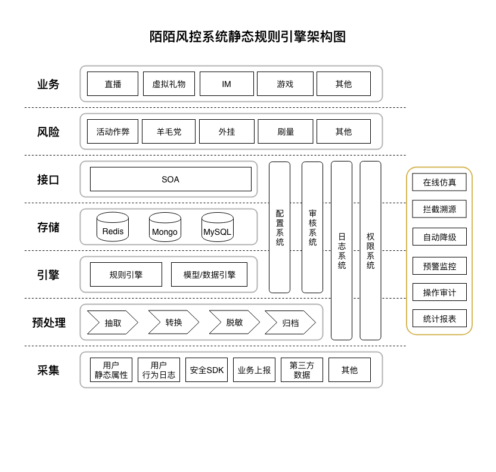
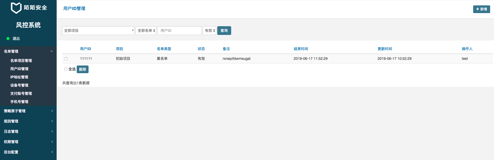
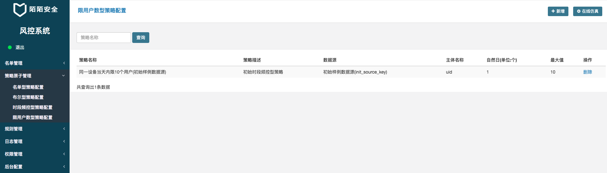
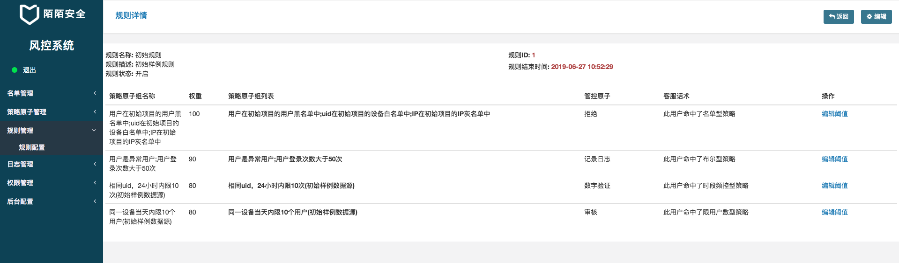
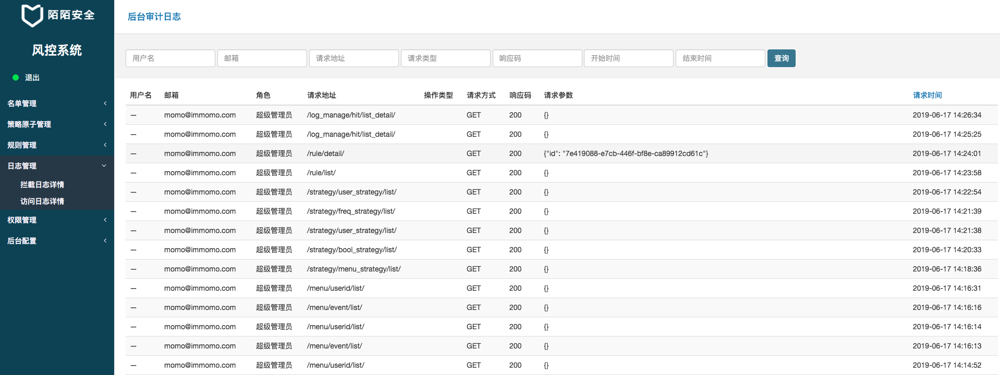

# 陌陌风控系统静态规则引擎

### 关于我们
Website：https://security.immomo.com

WeChat:<br>
<br>

[项目介绍](https://mp.weixin.qq.com/s/quk43WU3Vg9cQmub06Azqg)

### 架构介绍

   

本项目的主分支仅支持Python3，目前通过Python3.7.3的版本测试，如果需要python2.7的版本，请使用tag: last-support-Python2.7 的代码.

### 快速启动
1. 本项目依赖redis, mysql, mongodb，因此需准备环境并更改配置项
```bash
    # 为了简单可以使用docker安装
    # docker安装文档地址(以ubuntu为例): https://docs.docker.com/install/linux/docker-ce/ubuntu/
    mongo: docker run -d --name mongo -v $HOME/docker_volumes/mongodb:/data/db  -p 27017:27017 mongo:latest
    mysql: docker run -d --name mysql -e MYSQL_ROOT_PASSWORD=root -v $HOME/docker_volumes/mysql:/var/lib/mysql -v $HOME/docker_volumes/conf/mysql:/etc/mysql/conf.d -p 3306:3306 mysql:5.6
    redis: docker run -d --name redis -p 6379:6379  -v $HOME/docker_volumes/redis:/var/lib/redis redis:latest
```

2. 在mysql中创建risk_control库
```bash
    docker exec -it mysql mysql -h 127.0.0.1 -u root -p # 后续需输入密码 若以上述方式安装mysql，密码为root.
    CREATE DATABASE risk_control CHARACTER SET utf8mb4 COLLATE utf8mb4_unicode_ci; # 创建数据库时指定编码格式，规避乱码问题(注意: 此编码格式在mysql低版本上可能有兼容性问题)
```
3. 安装所需依赖，本项目基于python3.7进行开发，可运行pip install -r requirements.txt安装依赖包
4. 初始化django运行所需的表并创建账户，并可以预生成一些数据(可选)
```bash
    # 在www目录下
    python manage.py makemigrations && python manage.py migrate
    # 创建管理员账户  此处详见  其它操作--增加用户
    python manage.py createsuperuser # 后续 依次输入用户名、密码、邮箱 即可创建一个管理员账号
    # 如果希望对系统有一个直观的感受，可以使用如下指令来预注入一些数据
    python manage.py init_risk_data
```
5. 启动服务
```bash
    # 在aswan下以nohup的方式启动服务进程、管理后台、拦截日志消费进程
    bash start.sh
```

### 后台介绍
1. 名单管理

    为名单型策略提供基础的数据管理功能。

    名单数据的维度包括：用户ID、IP、设备号、支付账号、手机号。后续也可以根据自己的需求扩充其他的维度。

    名单包含三个类型：黑、白、灰名单

    名单必须属于某个项目(用于确定名单的范围)，可以在名单管理-名单项目管理中添加项目。

    

2. 名单型策略

    描述符为 **{参数名:单选,假设是“用户ID”} {操作码：在/不在} {XX项目:单选，可选全局} 的 {维度：单选}{方向：黑/白/灰名单}**

    示例：用户ID 在 初始项目 的 用户黑名单 中

    

3. 布尔型策略

    不传阈值的布尔型，描述符为 **{参数名:单选，假设是"账号ID"} {操作码：是/不是} {内置函数：异常用户}**
    示例：账号ID是异常用户

    传阈值的布尔型，描述符为 **{参数名:单选，假设是"账号ID"} {操作码：大于/小于/等于/不等于} {内置函数：历史登录次数} {阈值：170}**
    示例：账号ID历史登录次数大于100

    

    `内置函数`是什么？就是自定义的一些逻辑判断函数，只需要满足要求返回布尔值即可。比如注册时间是否在某个范围以内，当前设备是否是常用设备。

4. 时段频控型策略

    描述符为 **同一 {计数维度:单选，假设是“设备”} 在 {时段：时间跨度} 内限制 {阈值：整数N} 次 某动作**
    示例：同一设备一天内限制操作10次.
    可是我怎么知道当前已经有多少次呢？这就需要上报，上报后将计数  详见第9条 **数据源管理**

    

5. 限用户数型策略

    描述符为 **同一 {计数维度:单选，假设是“设备”} 在 {时段：时间跨度} 内限制 {阈值：整数N} 个用户**

    示例：同一设备当天限10个用户
    此策略同样需要上报的数据，且由于与用户相关，因此上报数据中必须包含user_id字段(在数据源中需配置)  详见第9条 **数据源管理**

    

6. 规则管理

    管控原子：命中某条策略后的管控动作，比如拦截...
    把上面2--5中所述的策略原子按照优先级组合起来，由上向下执行，直到命中某条策略，则返回对应策略的管控原子。此模块更多是重交互，完成策略的配置、组合、权重等等

    

7. 日志管理

    所有命中策略的日志均在此展示，也会包含审计相关的日志，`下一期会基于此日志，开放拦截溯源功能`。

    

    

8. 权限配置

    供权限设置使用，精确限定某个用户能看哪些页面的数据。 详见 其它 -- 权限管理。

9. 数据源配置

    示例策略：同一设备一天内限制登录1000次
    那么每次登陆就需要上报一条数据，系统会分类计数，并分类存储。
    存储的名字叫啥？就是此处要配置的数据源。对于此策略，只需要配置数据源，命名为login_uid, 字段包含uid, uid类型是string。然后程序就能根据uid为维度计数，并自动计算指定时间窗口内是否超出指定阈值。

    重要：由于逻辑必然依赖时间信息，为通用且必需字段，timestamp为默认隐含字段，类型是时间戳(精确到秒，整数)

    

### 调用样例

1. 调用查询服务

    假设存在id为1的规则，则可以通过如下方式查询是否命中策略
```
curl 127.0.0.1:50000/query/ -X POST -d '{"rule_id": "1", "user_id": "10000"}' -H "Content-Type:application/json"
```

2. 调用上报服务

    假设存在名称为test的数据源, 且数据源含有的数据是: {"ip": "string", "user_id": "string", "uid": "string"}
```
curl 127.0.0.1:50000/report/ -X POST -d '{"source_name": "test", "user_id": "10000", "ip": "127.0.0.1", "uid": "abcabc112333222", "timestamp": 1559049606}' -H "Content-Type:application/json"
```

3. 关于服务拆分

    开源样例中，为了简化安装部署，查询和上报揉进了一个服务。实际场景中，显然读写应该分离。

    1.可以直接此方式部署2份，域名不同，一份用于查询(上报接口不被访问)，一份用于上报(查询接口不被访问)，流量分发在nginx层完成

    2.risk_server.py中修改配置URL_2_HANDLERS，选择您需要的服务接口部署


## 内置函数的扩展
1. 不带阈值的内置函数扩展

    以`是否异常用户`内置函数为例
    代码见 aswan/buildin_funcs/sample.py 中的 is_abnormal 方法

2. 带阈值的内置函数布尔型策略扩展

    以`历史登录次数`内置函数为例
    代码见 aswan/buildin_funcs/sample.py 中的 user_login_count 方法
    注意：阈值计算不包含在内置函数中进行，控制流详见 aswan/buildin_funcs/base.py

## 其它

### 增加用户

考虑到企业用户大多数为域账户登录，因此推荐使用LDAP认证模块直接集成。但考虑到大家的场景不一样，因此也可以手动增加用户，样例代码如下:
```python
# coding=utf-8
from django.contrib.auth.models import User

username = 'username'
password = 'password'
email = 'email@momo.com'
first_name = '测'
last_name = '试'
# 普通用户
User.objects.create_user(username=username, password=password, email=email, first_name=first_name, last_name=last_name)
# 管理员账户
User.objects.create_superuser(username=username, password=password, email=email, first_name=first_name, last_name=last_name)
```

添加完成后，让用户登录，然后管理员配置权限即可。

### 权限管理

目前的权限模型包含如下元素，可在对应的页面进行配置。

|元素名称 | 元素含义 | 配置方式 | 注 |
| :-----| ----: | :----: | :----: |
| uri | 风控管理后台的一个独立uri | 开发时自动产生 | 此处uri为相对路径，例如: /permissions/groups/ |
| uri组 | 多个相互关联的uri可以被放置到一个uri组中 | /permissions/uri_groups/ | - |
| 权限组 | 多个uri组可以被分配到一个权限组中 | /permissions/groups/ | - |
| 用户 | 用户即为独立的个人/员工 | /permissions/users/ | 1. 本系统在界面上不提供添加用户的功能；2. 用户可以被分配到某个权限组中，也可以直接配置uri组 |
| 管理员 | 即为系统的拥有者，默认拥有所有权限 | 手动配置 | - |

具体图示如下:

   

   

   

### 配置相关

目前Django部分的配置均存放于 www/settings 目录，非Django部分的配置均位于 config 目录下。

为了在不同环境加载不同的配置，我们使用了RISK_ENV这个环境变量，系统在运行时会自动通过这个环境变量的值加载对应的配置文件。

为了方便项目启动，在未设置这个值时，系统默认会加载 develop 环境的配置。而在执行测试时(python manage.py test)时，RISK_ENV的值必须是 test 。

### aswan系统的工作流

1. 业务方在用户执行前调用 query 接口，根据返回的管控码来判定当前行为是否被拦截(此部分需与业务方协商)，被拦截则转向2，无操作则转向3；
2. 用户动作失败，转向5；
3. 执行业务侧逻辑，若最终用户成功转向4，否则转向5；
4. 风控系统存在数据源相关的策略则调用 report 接口来上报结果供引擎后续计算，转向5；
5. 直接结束。

#### 例子

现在有一个打地鼠的活动，打地鼠成功可获得小礼物一个

#### 规则

业务侧规则为：
1. 用户每次打地鼠有10%的概率成功

风控侧规则为：
1. 异常用户不能打地鼠 --> deny
2. 同uid上30分钟内限1次 --> deny

#### 请求示例

以一个正常用户执行多次动作(假设每次执行时间间隔均为5s)来举例:  
第一次：用户打地鼠前，调用query接口，由于未命中策略，得到pass，但用户运气不好(业务侧规则)，打地鼠失败，则直接结束  
第二次：用户打地鼠前，调用query接口，由于未命中策略，得到pass，且用户运气不错(业务侧规则)，打地鼠成功，则调用report上报数据  
第三次：用户打地鼠前，调用query接口，命中时段频控型策略，得到deny，此次行为被拦截，用户打地鼠失败，结束  
...  
在某个时刻，此用户由于某些规则被判定为异常用户  
...  
第四次：用户打地鼠前，调用query接口，命中bool型策略(异常用户)，得到deny，此次行为被拦截，用户打地鼠失败，结束

### 项目代码测试

```shell
$ pip install coverage
$ export RISK_ENV=test
$ python www/manage.py test
$ cd tests && python run_test.py
```

> 欢迎各位在issue里对本项目提供宝贵意见
